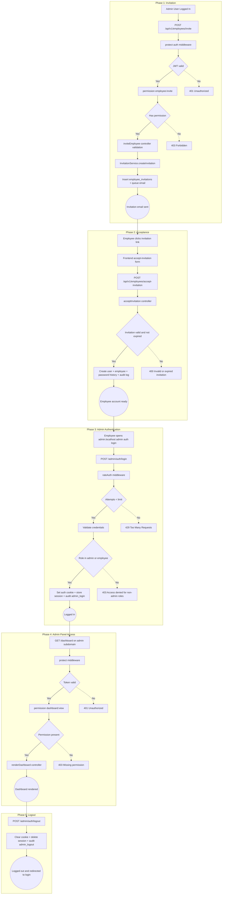
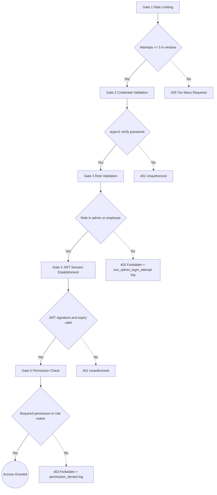
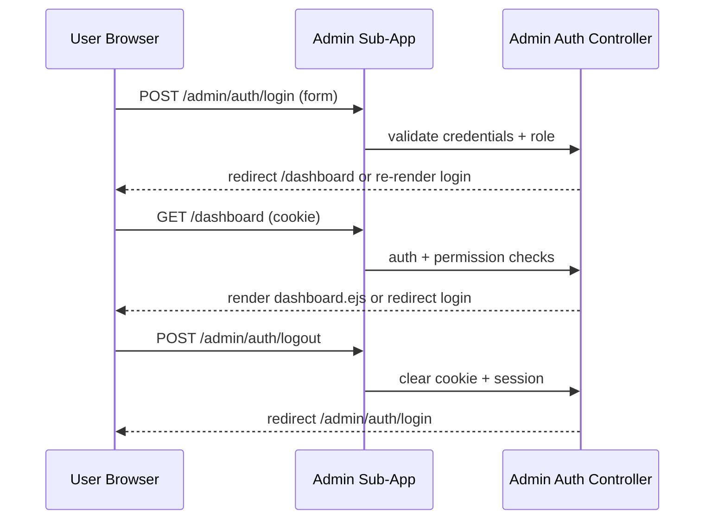
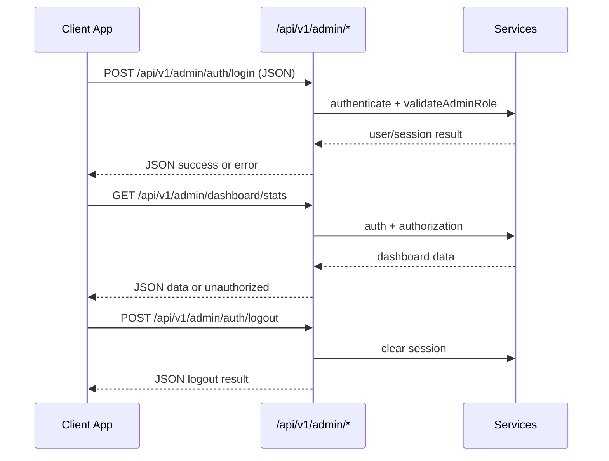
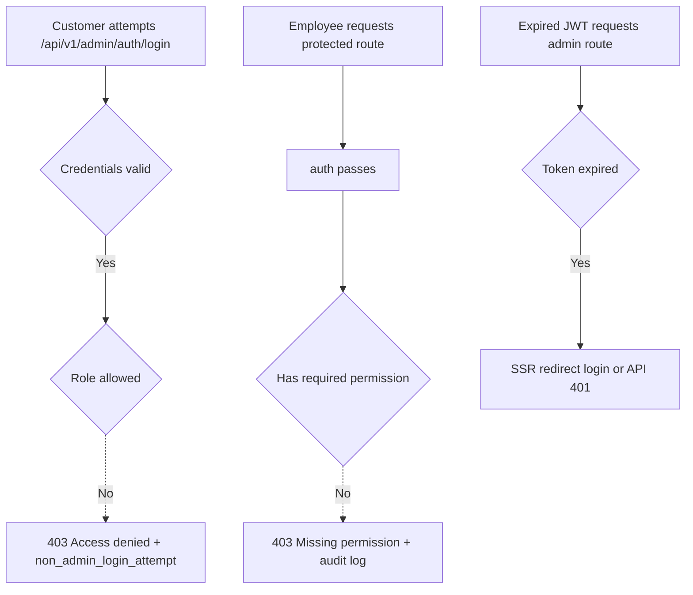
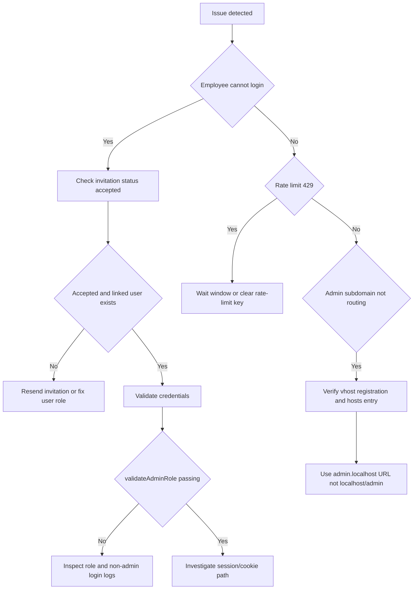
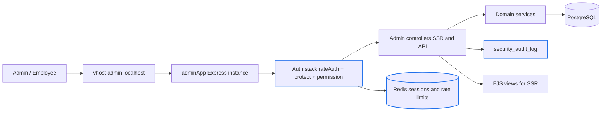

# Admin System - Visual Control Flow Diagrams

## Legend

- Rectangle: process/action
- Diamond: decision
- Rounded node: state/result
- Dashed path: error/failure branch

---

## Complete Employee Journey: Invitation -> Logout

---

## Security Gate Details

---

## SSR vs API Flow Comparison

### SSR Flow (Browser)

### API Flow (JSON)

---

## Access Denied Scenarios

---

## Troubleshooting Flowchart

---

## Architecture Summary Diagram

---

End of visual control flow documentation.
