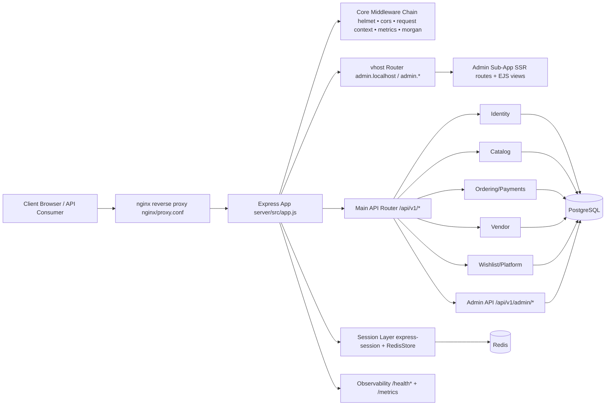
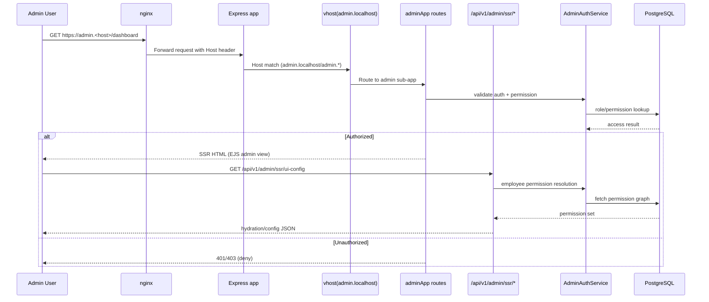

# System Control Visual Flow

This document maps runtime control flow for the current codebase from ingress to domain execution, including admin subdomain SSR, auth gates, and operational controls.

## 1) System Control Topology



## 2) Request Control Path (API)

```mermaid
flowchart TD
  RQ[Incoming HTTP Request] --> SEC[Security Middleware helmet policies]
  SEC --> CORS[CORS evaluation allowed origin/credentials]
  CORS --> CTX[Correlation + timing context]
  CTX --> MET[Metrics middleware request counters & latency]
  MET --> BODY[Body parsing / cookies]

  BODY --> AUTHN{Auth present? JWT or session}
  AUTHN -->|No| ROUTE[Route handler (public path)]
  AUTHN -->|Yes| USER[req.user attached]

  USER --> AUTHZ{Route requires auth/role/permission?}
  AUTHZ -->|No| ROUTE
  AUTHZ -->|Yes| ENFORCE[requireAuth / domain permission checks]

  ENFORCE --> CTRL[Controller]
  ROUTE --> CTRL
  CTRL --> SRV[Service / Domain policy]
  SRV --> REPO[Repository / SQL]
  REPO --> DB[(PostgreSQL)]
  DB --> RESP[HTTP Response]

  RESP --> OBS[Finish hook error count + duration histogram]
```

## 3) Admin Portal Control Flow (Subdomain + SSR)



## 4) Operational Control Loop (Jobs, Health, Metrics)

```mermaid
flowchart LR
  OP[Operator / SRE] --> J[/api/v1/admin/jobs/*]
  J --> RA[requireAuth + role gate\nroot/super_admin]
  RA --> JS[JobScheduler / Job Controllers]
  JS --> EXT[External providers\n(e.g., exchange rates)]
  JS --> DB[(PostgreSQL)]

  APP[Express runtime] --> H[/health /health/ready /health/live]
  APP --> MX[/metrics]
  MX --> MON[Prometheus/Grafana or monitor]

  DB --> HEALTH[Health checks & readiness signals]
  RED[(Redis)] --> HEALTH
```

## Source Anchors

- Entry and middleware orchestration: `server/src/app.js`
- Server bootstrap: `server/src/index.js`
- Admin vhost SSR router: `server/api/routes/admin/index.js`
- Admin SSR API routes: `server/api/routes/v1/admin/ssr.js`
- Admin SSR control logic: `server/api/controllers/v1/admin/ssr.js`
- Session control: `server/config/session.js`
- Security + CORS policy: `server/config/security.js`
- Auth middleware behavior: `server/api/middleware/auth.js`
- Metrics middleware and endpoint: `server/api/middleware/metrics.js`
- Reverse proxy ingress: `nginx/proxy.conf`
