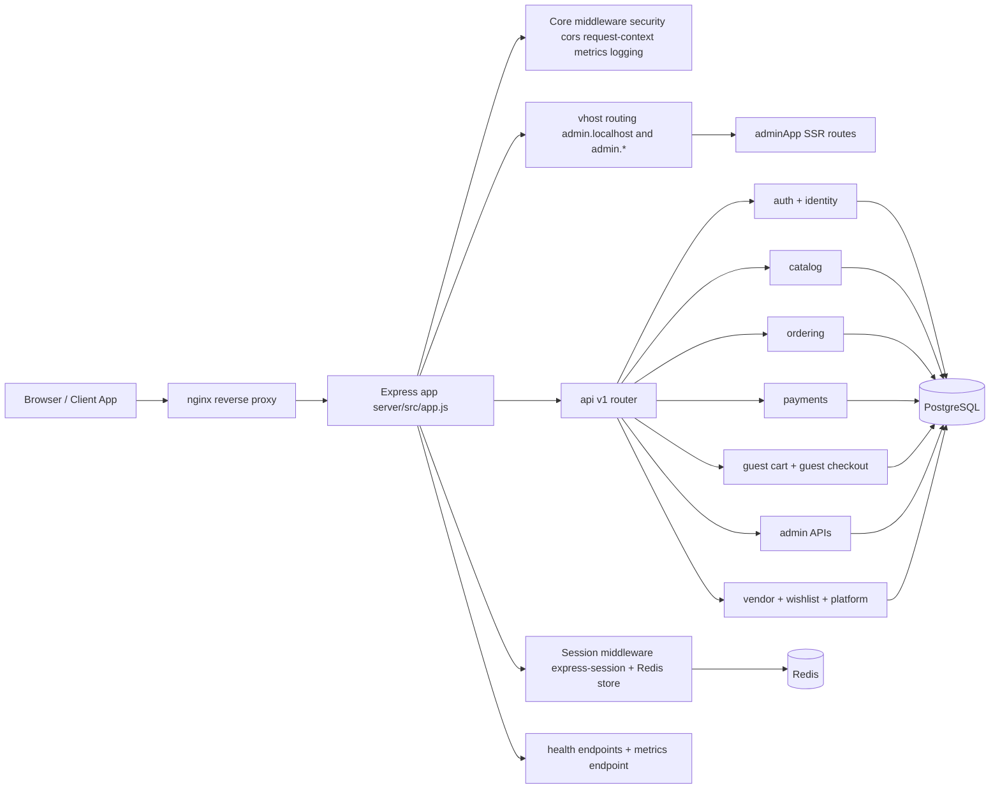
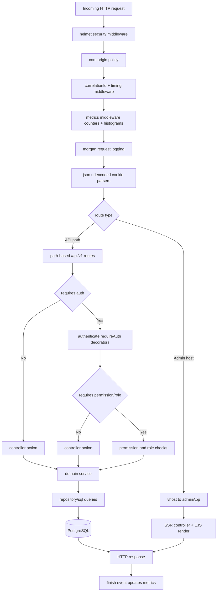
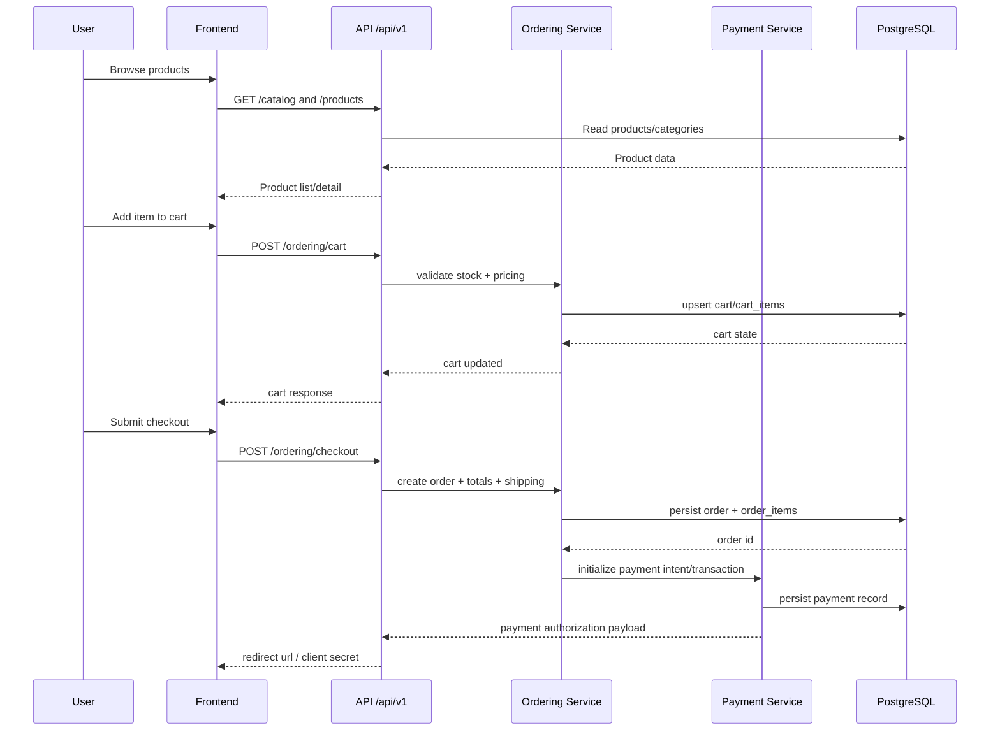
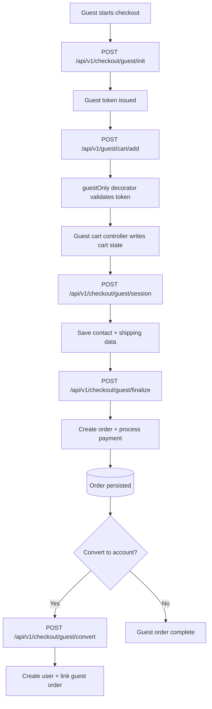
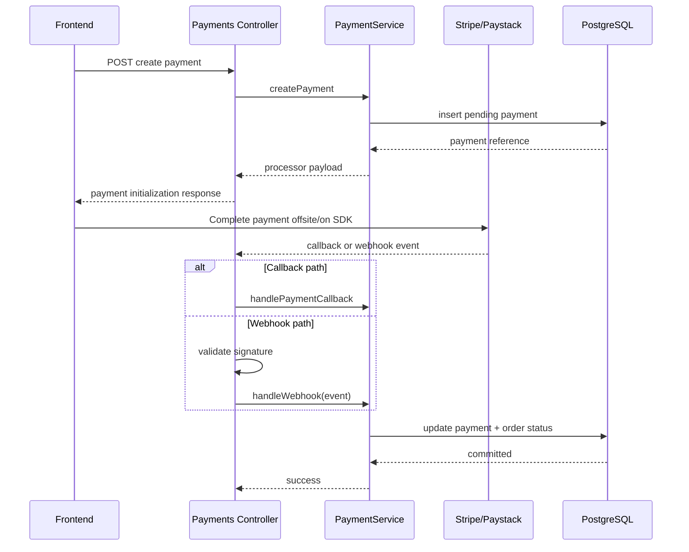
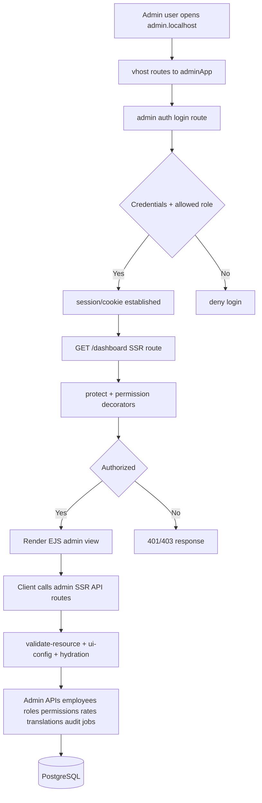
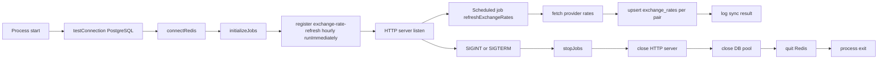
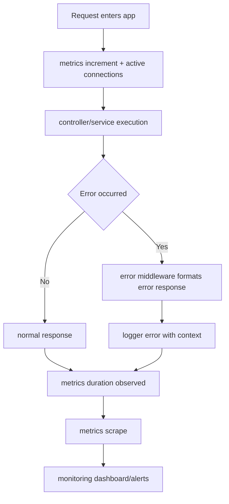

# Web App - Full Visual Control Flow (Mermaid)

This document provides an end-to-end control-flow view of the web application across user journeys, admin surface, API execution, payment/webhook handling, background jobs, and operational controls.

## 1) End-to-End Runtime Topology

## 2) HTTP Request Control Pipeline

## 3) Customer Journey: Browse -> Cart -> Checkout -> Payment

## 4) Guest Checkout Control Flow

## 5) Payment and Webhook Control Flow

## 6) Admin Portal Flow (Subdomain + SSR + Admin APIs)

## 7) Startup, Background Jobs, and Shutdown Controls

## 8) Observability and Failure Paths

---

## Source Anchors

- server/src/app.js
- server/src/setup.js
- nginx/proxy.conf
- server/api/routes/v1/admin/index.js
- server/api/routes/admin/index.js
- server/api/routes/v1/checkout/guest.js
- server/api/routes/v1/guest/cart.js
- server/api/controllers/v1/payments/payment.js
- server/infrastructure/jobs/initializeJobs.js
