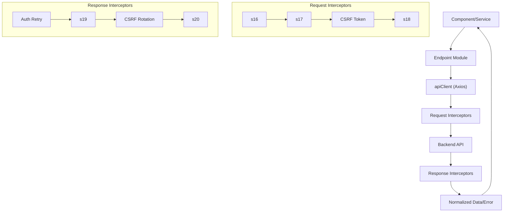

Update All Route/Controller Middleware Usage (if needed):

Double-check that all routes and controllers use the new unified auth middleware from server/core/auth (most direct imports are already updated, but review for any custom or legacy usage).

Test and Validate:

Run backend E2E, integration, and unit tests from the server directory to ensure all authentication and security changes work as expected.
Run frontend E2E and unit tests to confirm no regressions in auth flows.

Update Documentation:

Document the new single-source auth module and security requirements (secrets, CSP) in your project README or developer docs.

CI/CD Pipeline:

Ensure CI/CD is updated to require secrets in production and to fail if any are missing.
Add/verify a CI job that runs all tests with live Postgres/Redis (using docker-compose.test.yml).

Production Secrets:

Set strong secrets in your production environment (no defaults).
Validate that the app fails to start in production if secrets are missing.

Manual QA:

Manually test SSR (EJS) and React auth flows, including admin and guest scenarios, to confirm compatibility.

